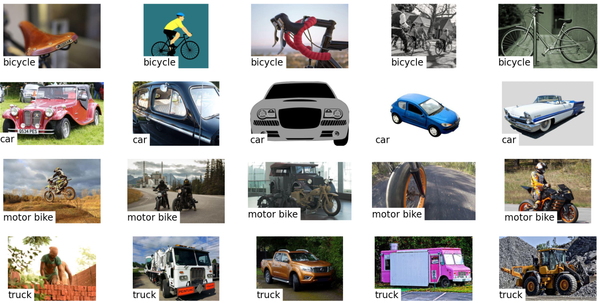

# Vision-Transformer-for-Multiclass-Classification
Vision Transformer (ViT) model for multi-class image classification using PyTorch and Hugging Face's `transformers` library.

## Overview

This project implements a Vision Transformer (ViT) model for multi-class image classification using PyTorch and Hugging Face's `transformers` library. Vision Transformers apply the transformer architecture, originally designed for natural language processing, to images. This approach has shown competitive performance on various image classification tasks.

## Dataset

The dataset contains images for four classes: **Truck**, **Bicycle**, **Car**, and **Motorbike** (each containing 150 images). The dataset can be downloaded from the following link:

[Download Dataset](https://drive.google.com/drive/folders/18Nm5Xp_-WkCbgYQQhFEDhygg1L1MGFoz?usp=drive_link)

Here is a snapshot of the data with the labels:

 

The dataset is loaded using `torchvision.datasets.ImageFolder`, which expects the images to be organized in subdirectories corresponding to their class labels.

Data transformations such as resizing, normalization, and augmentation are applied to the images using `torchvision.transforms`.

## Model

The Vision Transformer (`ViTForImageClassification`) is initialized from Hugging Face's `transformers` library. The feature extractor (`ViTFeatureExtractor`) is used for preprocessing images before feeding them into the model.

Training 

The model is trained using PyTorch Lightning, which simplifies the training loop, validation, and logging. The code includes hyperparameter configuration, data loaders for training/validation, and model checkpoints.

```python
trainer = pl.Trainer(max_epochs=10, gpus=1)
trainer.fit(model, train_dataloader, val_dataloader)
```

Evaluation
After training, the model is evaluated on the validation set using accuracy as a metric. Other metrics such as precision, recall, and F1-score can also be integrated using torchmetrics.
```python
trainer.validate(model, val_dataloader)
```

## Results

Accuracy: The model achieved 89% accuracy on the validation set after training for 10 epochs.
Loss: The final loss on the validation set was Z.